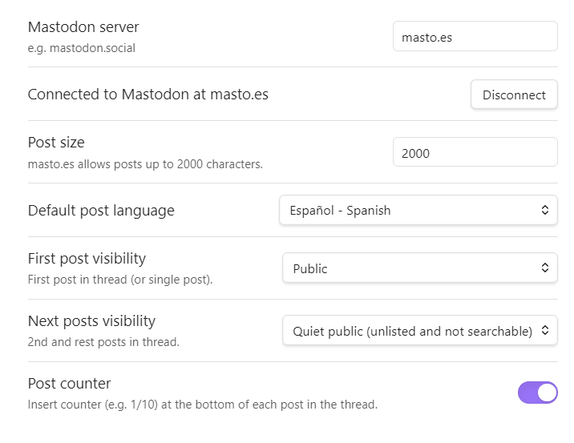

# mastodon-threading

Obsidian plugin to compose and post threads to Mastodon.

## Introduction

[Mastodon](https://joinmastodon.org/) is a microblogging network (similar to Twitter), where users can publish text posts and optionally attach media such as pictures, audio, video, or polls. It also lets you follow friends and discover new ones.

Mastodon allows you to link responses together, one after another, to form a thread. Many users on this network, as has been done on Twitter before, use threads to post content that is longer than the limitations of the format would allow.

Making threads can be tedious, manually pasting text and images. This plugin allows you to leverage Obsidian's editing capabilities to prepare thread snippets and then send them to the Mastodon server automatically.

## Features

This plugin can:
- Insert thread separators manually or automatically.
- Visualize the order of fragments and their size as they are typed.
- Add descriptions to images and other media to facilitate accessibility for people with visual impairments.
- Submit individual posts or entire threads directly to the Mastodon server, checking the size limitations and different types of visibility supported by the server.

## Installation

This plugin is tested under Obsidian v1.7.7. It may work with older versions, but it is untested.

To install Obsidian, download it from the [official site](https://obsidian.md/) and follow their instructions. Once you have Obsidian installed and created your vault, you can proceed to install the plugin.

> ATTENTION: This plugin is in testing and has not yet been included in the official Obsidian repository. At the moment, the only way to install it is manually, and you do so at YOUR OWN RESPONSIBILITY. I cannot be held responsible for any information or resources that may be damaged. You're warned.

### Manual installation

- Download `main.js`, `manifest.json` and `styles.css` from the [releases page](https://github.com/elpamplina/mastodon-threading/releases).
- Create (if it doesn't exist) a folder `<path-to-obsidian-vault>/.obsidian/plugins/mastodon-threading/` and copy in it the files.
- Run Obsidian, open your vault, open Settings, and enable Mastodon Threading on the Community Plugins tab.

You can also install it with the [BRAT plugin helper](https://github.com/TfTHacker/obsidian42-brat). Follow its instructions to get the plugin and enable it.

## Build 

To build the plugin, you need [Node.js](https://nodejs.org) with [NPM](https://www.npmjs.com/) or similar manager installed in your computer. Clone the source, install all dependencies and build the plugin:
```sh
$ git clone https://github.com/elpamplina/mastodon-threading.git
$ cd mastodon-threading
$ npm install
$ npm run build
```

## Settings



### Connect to server

Before you use the plugin for the first time, you need to go into the settings to establish a connection to your Mastodon server.

As you know, Mastodon is a distributed network, which means that there are many servers (also known as *instances*) that collaborate by sending posts. To use the plugin, you need to connect to the server that your personal account lives on and give the plugin permissions to send posts.

If you don't know which server your personal account is, just look at the second part of your username. For example, if your name is `@jane@example.org`, then your server is `example.org`.

Type your server name in the box provided and press "Connect"

A browser window will open on your server, asking for your user credentials, and then for you to grant write permission to the plugin.

Once permission is granted, the browser may ask you if you want to return to Obsidian, or you will be redirected automatically. It is necessary to return to Obsidian to store the authorization, and then it will be indicated that you are connected. The connection and authorization process is only necessary the first time you use the plugin. From then on, the plugin stores its credentials (not yours) securely until you press "Disconnect."

If the process fails, you can start it from the beginning as many times as necessary.

> IMPORTANT: This plugin complies with the [official Mastodon authentication guide](https://docs.joinmastodon.org/client/token/). At no time does the plugin have access to your user credentials, nor does it store any personal information in any way, nor does it have access to your posts or your user profile. Nor does it collect any information from your account, not even that which is publicly accessible. The plugin stores in encrypted form only the tokens that the server sends to it using the secure [OAuth](https://docs.joinmastodon.org/spec/oauth/) protocol.

### Other settings

- **Post size**: Sets the maximum post size that the plugin will send to Mastodon. By default, it is set to the maximum allowed by your server. This value is taken into account while editing the text, when preparing the submission, and also when using the auto-split command.
- **First post visibility**: Sets the default visibility of the first post in the thread. This will be "public" by default.
- **Next posts visibility**: Sets the default visibility of the second and subsequent posts in the thread. This will be "quiet public" by default.
- **Post counter**: Sets whether to insert the fragment number at the end of each post (e.g. `[1/10]`). By default, this is disabled.

### Visibility

In Mastodon, visibility (aka [publishing level](https://docs.joinmastodon.org/user/posting/#privacy)) allows you to decide how your posts are published on the network:
- Public: The post is published on the local timeline (and possibly in the federated one) and can be read and searched publicly. This setting can be modified if you have activated the privacy options in your user profile.
- Quiet public: The post can be read by anyone, but it will not be in searches or published in timeline.
- Private: The post can only be read by your followers, and it will not appear in searches or timeline.

In Mastodon there is another visibility (direct), which is not supported by this plugin.

> NOTE: Before using this plugin, please check your server's rules regarding posting. It is common that posting entire threads to the public to be considered disrespectful. This plugin recommends posting only the first post in the thread to the public. You must also follow the rest of the server rules regarding prohibited topics and content.

## Usage

The plugin adds the following commands to the Obsidian's palette:

- **Send single post to Mastodon**: Sends the selected text to your Mastodon server as a single post. This option only sends text, not images, and is intended to check that your connection to the server is working properly.
- **Insert thread separator**: Separators allow you to create fragments in the text, which will form the posts of the thread. The separator is inserted at the current cursor position.
- **Insert thread separators automatically**: Inserts separators in the active editor at sufficient intervals to not exceed the maximum size set. Separators are only placed between paragraphs, they do not break paragraphs in half. If you want to separate a paragraph, you can do it manually. This process is not perfect if there are very long paragraphs, or if the text has an unusual structure, so you will have to review the result and manually modify what did not turn out well.
- **Remove all thread separators**: In the active editor, all thread separators are removed. You can always remove them manually using the standard editor tools.
- **Send thread to Mastodon**: All fragments from the active editor are sent as a thread, checking first that the size and format are correct. Images are attached with descriptions (if available).

The "Send single post to Mastodon" and "Insert thread separator" commands also appear in the context menu of the Obsidian editor.

The "Send thread to Mastodon" command also appears in the icons ribbon (if available).

### Separators

Separators are the primary tool for composing threads. They are used to place text and images into chunks that will then be sent as posts in the thread.


In Obsidian's edit mode, separators are displayed as horizontal lines with a chunk counter and a character counter.

When the maximum size is exceeded, this is indicated visually by turning the counters red.

In Obsidian's view mode, separators appear as simple horizontal lines with no counter.

When the plugin is disabled, or when copying text somewhere outside the vault, separators are displayed with the typographical paragraph symbol (§).

### Quotes and media descriptions

The plugin uses quote blocks (starting with the Markdown symbol ">") to add descriptions to images and other media. Just add a quote after a media, and it will be sent as description.


Quote blocks that are not directly behind an image will be ignored and will not be sent as part of the thread. Feel free to use them as a place to keep comments or notes. 

### Content warning

Starting a line with "!!" symbols will make it a content warning (aka spoiler text). Mastodon will show the rest of the post collapsed behind this warning.

## Questions, suggestions or bugs

You are greatly welcome to ask questions, post any suggestions, or report any bugs! You can do it directly here in Github, or by email at <elpamplinadecai@gmail.com>, or in Mastodon at @ElPamplina@masto.es

Please note that this is a side project I'm working on in my spare time. I cannot guarantee responsiveness or maintenance beyond my personal circumstances.

## Internationalization

Language definitions are in the `lang` folder. Currently only English (default) and Spanish are supported. Constributions in other languages are GREATLY APPRECIATED!!

Please send your language definitions via Pull Request on Github, or contact me at <elpamplinadecai@gmail.com> for further instructions.

## License

This plugin is free software, released under the [General Public License version 2](https://www.gnu.org/licenses/old-licenses/gpl-2.0.html).

## Acknowledgements

This plugin is made and maintained as a side project for amusement only.

- Many thanks to Ulises Lafuente (@Rataunderground@paquita.masto.host) for adapting the Mastodon icon.
- Thanks to Eugen Rochko and all the Mastodon team for creating the best open and free social network ruled by the people.
- Thanks to Ryō Igarashi for maintaining the masto.js library.
- Thanks to the people at Obsidian for this great software.
- And finally, thanks to the open source community for making the world better for all.
